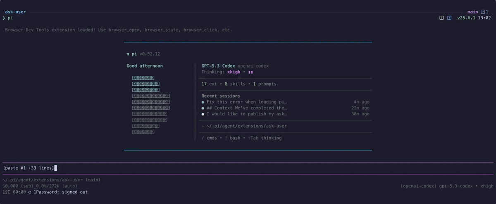

# pi-ask-user

A Pi package that adds an interactive `ask_user` tool for collecting user decisions during an agent run.

## Demo



High-quality video: [ask-user-demo.mp4](./media/ask-user-demo.mp4)

## Features

- Searchable single-select option lists with wrapped titles and descriptions
- Responsive split-pane details preview on wide terminals with single-column fallback on narrow terminals
- Multi-select option lists
- Optional freeform responses
- User-toggleable extra context on structured selections
- Context display support
- Configurable display mode: `overlay` (modal, default) or `inline` (rendered directly in the flow)
- Runtime overlay toggle: press the configured overlay-toggle key (`alt+o` by default, configurable per call or via env var) while the prompt is open to temporarily hide/show the popup so you can read prior agent output, then press it again to bring it back
- Pi-TUI-aligned keybinding and editor behavior
- Custom TUI rendering for tool calls and results
- System prompt integration via `promptSnippet` and `promptGuidelines`
- Optional timeout for auto-dismiss in both overlay and fallback input modes
- Structured `details` on all results for session state reconstruction
- Graceful fallback when interactive UI is unavailable
- Bundled `ask-user` skill for mandatory decision-gating in high-stakes or ambiguous tasks

## Bundled skill: `ask-user`

This package now ships a skill at `skills/ask-user/SKILL.md` that nudges/mandates the agent to use `ask_user` when:

- architectural trade-offs are high impact
- requirements are ambiguous or conflicting
- assumptions would materially change implementation

The skill follows a "decision handshake" flow:

1. Gather evidence and summarize context
2. Ask one focused question via `ask_user`
3. Wait for explicit user choice
4. Confirm the decision, then proceed

See: `skills/ask-user/references/ask-user-skill-extension-spec.md`.

## Install

```bash
pi install npm:pi-ask-user
```

## Tool name

The registered tool name is:

- `ask_user`

## Parameters

| Parameter | Type | Default | Description |
|-----------|------|---------|-------------|
| `question` | `string` | *required* | The question to ask the user |
| `context` | `string?` | — | Relevant context summary shown before the question |
| `options` | `(string \| {title, description?})[]?` | `[]` | Multiple-choice options |
| `allowMultiple` | `boolean?` | `false` | Enable multi-select mode |
| `allowFreeform` | `boolean?` | `true` | Add a "Type something" freeform option |
| `allowComment` | `boolean?` | `false` | Expose a user-toggleable extra-context option in the custom UI (`ctrl+g` or the toggle row) and collect an optional comment in fallback dialogs |
| `displayMode` | `"overlay" \| "inline"?` | env var or `"overlay"` | Controls custom UI rendering: `overlay` shows the centered modal (current behavior), `inline` renders without overlay framing |
| `overlayToggleKey` | `string?` | env var or `"alt+o"` | Shortcut for hiding/showing the overlay popup (overlay mode only). Pi-TUI key spec, e.g. `"alt+o"`, `"ctrl+shift+h"`. Pass `"off"` to disable. |
| `commentToggleKey` | `string?` | env var or `"ctrl+g"` | Shortcut for toggling the optional comment/extra-context row when `allowComment: true`. Pass `"off"` to disable. |
| `timeout` | `number?` | — | Auto-dismiss after N ms and return `null` if the prompt times out |

## Example usage shape

```json
{
  "question": "Which option should we use?",
  "context": "We are choosing a deploy target.",
  "options": [
    "staging",
    { "title": "production", "description": "Customer-facing" }
  ],
  "allowMultiple": false,
  "allowFreeform": true,
  "allowComment": true,
  "displayMode": "inline"
}
```

`displayMode: "inline"` uses the same interaction logic but skips overlay mode when calling `ctx.ui.custom(...)`. RPC/headless fallback behavior is unchanged.

## Personal preferences via environment variables

Configure your defaults globally by setting these in your shell profile (`~/.zshrc`, `~/.bash_profile`, etc.):

```bash
export PI_ASK_USER_DISPLAY_MODE=inline
export PI_ASK_USER_OVERLAY_TOGGLE_KEY=alt+h
export PI_ASK_USER_COMMENT_TOGGLE_KEY=alt+c
```

### Display mode

Effective order:

1. Per-call `displayMode` parameter (if provided)
2. `PI_ASK_USER_DISPLAY_MODE` (if set to `"overlay"` or `"inline"`)
3. Fallback default: `"overlay"`

Unrecognised values are silently ignored and fall back to `"overlay"`.

### Shortcuts

Effective order for both `overlayToggleKey` and `commentToggleKey`:

1. Per-call parameter (if provided)
2. Matching env var (`PI_ASK_USER_OVERLAY_TOGGLE_KEY` / `PI_ASK_USER_COMMENT_TOGGLE_KEY`)
3. Built-in defaults: `alt+o` and `ctrl+g`

Pass `"off"`, `"none"`, or `"disabled"` (at any level) to disable the shortcut entirely. Invalid specs are silently dropped and the next source is used. Specs follow the Pi-TUI [`KeyId`](https://github.com/earendil-works/pi-mono/blob/main/packages/tui/src/keys.ts) format: `[mod+]...key` where modifiers are `ctrl`, `shift`, `alt`, `super`, in any order, joined by `+` (e.g. `ctrl+g`, `alt+shift+x`, `escape`, `tab`).

## Controls

While an `ask_user` prompt is open:

| Key | Action |
|-----|--------|
| `alt+o` (configurable via `overlayToggleKey`) | Hide/show the overlay popup so you can read the agent's prior output. Available in `overlay` mode only. The first time you hide it, a notification reminds you which key brings it back. |
| `ctrl+g` (configurable via `commentToggleKey`) | Toggle the optional comment/extra-context row (when `allowComment: true`). |
| `enter` | Confirm the focused option, submit a freeform response, or submit/skip an optional comment. |
| `esc` | Clear the search filter, exit freeform/comment mode, or cancel the prompt. |
| `↑` / `↓`, `ctrl+k` / `ctrl+j` | Navigate options. `ctrl+k` / `ctrl+j` (vim-style) work while typing in searchable prompts without disturbing the filter. |

If you prefer never to see the overlay, set `displayMode: "inline"` per call or `PI_ASK_USER_DISPLAY_MODE=inline` globally.

## Result details

All tool results include a structured `details` object for rendering and session state reconstruction:

```typescript
type AskResponse =
  | { kind: "selection"; selections: string[]; comment?: string }
  | { kind: "freeform"; text: string; comment?: string };

interface AskToolDetails {
  question: string;
  context?: string;
  options: QuestionOption[];
  response: AskResponse | null;
  cancelled: boolean;
}
```

## External prompt responder events

Integrations that run inside the same Pi process can mirror an `ask_user` prompt
in another surface (for example a mobile app, chat bridge, or web UI) without
replacing the local TUI. The extension emits process-local events on
`pi.events`:

### `ask:prompt`

Emitted after input normalization and before the local prompt is answered.

```typescript
type ExternalAskPromptEvent = {
  toolCallId: string;
  question: string;
  context?: string;
  options: QuestionOption[];
  allowMultiple: boolean;
  allowFreeform: boolean;
  allowComment: boolean;

  // Resolve the prompt from the external surface. Pass null to cancel.
  // Returns false if the prompt already settled locally or externally.
  respond(result: AskResponse | null): boolean;

  // Alias for respond(), kept for integrations that use resolve naming.
  resolve(result: AskResponse | null): boolean;
};
```

The first answer wins. If the external surface calls `respond(...)` first, the
local prompt closes and the tool returns a normal `ask_user` result. If the local
TUI answers first, later external calls return `false`.

### `ask:answered` / `ask:cancelled`

Emitted when the local or external answer is finalized, so mirrored UIs can mark
their prompt as answered or cancelled:

```typescript
pi.events.on("ask:answered", (event) => {
  // { toolCallId, question, context, response }
});

pi.events.on("ask:cancelled", (event) => {
  // { toolCallId, question, context, options }
});
```

These events are intentionally in-process callbacks, not a serializable wire
protocol. Bridge extensions should translate them into their own transport
format when forwarding prompts to another device or service.

## Changelog

See [CHANGELOG.md](./CHANGELOG.md).
